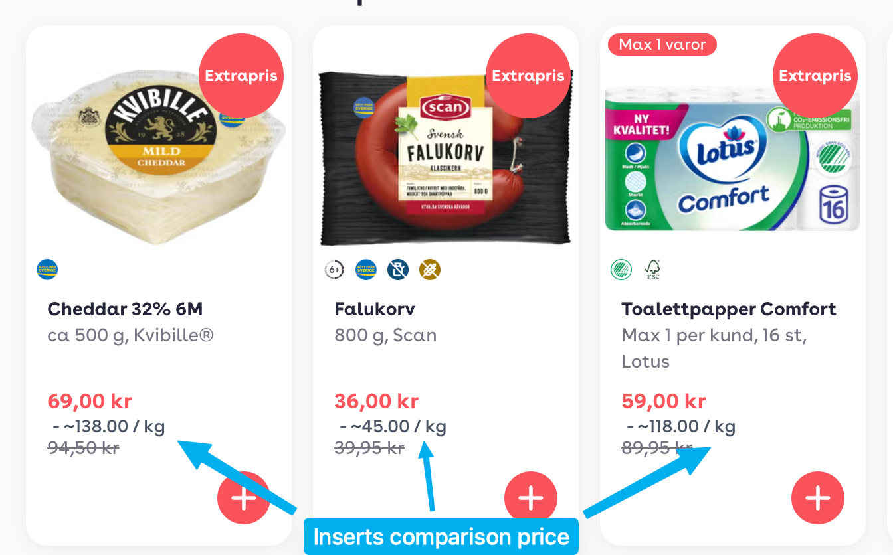

# Price-Weight-Comparison-Injector

A Chrome extension that automatically calculates and displays unit prices (price per kg or liter) for products on any webpage. Perfect for comparing products with different package sizes when shopping online.

## Installation

1. **Download the repository**

   - Clone this repo or download as ZIP and extract it

2. **Load the extension in Chrome**

   - Open Chrome and navigate to `chrome://extensions/`
   - Enable **Developer mode** (toggle in the top right)
   - Click **Load unpacked**
   - Select the folder containing this extension

3. **Start shopping!**
   - Visit any online store and the extension will automatically display unit prices next to product prices

## How It Works

The extension scans webpages for price and weight/volume information, then calculates and displays the unit price inline with the original price. For example:

- **99 kr** for 500g → displays **- ~198.00 / kg**
- **36 kr** for 800g → displays **- ~45.00 / kg**

This makes it easy to compare value across different package sizes!
